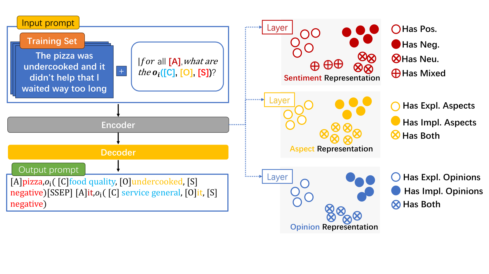

# MvGEN-SCL-for-ACOSQE
<h1 align="center">
Improving Generative Aspect-Based Sentiment Analysis via Multi-View Data Augmentation and Supervised Contrastive Learning
</h1>

## ✨ Introduction 

MvGEN-SCL simultaneously employs multi-view data augmentation and supervised contrastive learning:

- MvGEN-SCL  **combination of elements**:

    

